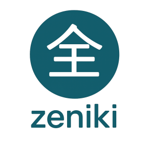

<div align="center">
  
</div>

# Zeniki

> A TypeScript API communication library for commonly used network hardware and tools

[](https://www.npmjs.com/package/@norskhelsenett/zeniki)
[](https://www.typescriptlang.org/)
[](https://opensource.org/licenses/Apache-2.0)

Zeniki is a modern TypeScript library that provides type-safe, well-documented drivers for network infrastructure platforms including NetBox IPAM, FortiGate firewalls, VMware NSX, and Network Architecture Management (NAM) v2. Features comprehensive type safety with NHN-specific custom field types, immutable API responses, and enterprise-grade network automation capabilities.

## ⚠️ Breaking Changes in v0.5.0

**SubDriver Architecture**: Version 0.5.0 introduces a new SubDriver architecture that changes how you access driver methods. 
The last version supporting the old implementation is **0.4.x**.

### Migration Guide

**Old Implementation (v0.4.x and earlier):**
```typescript
const netbox = new NetboxDriver({ baseURL: '...', headers: {...} });

// Methods called directly on driver instance
const prefixes = await netbox.getPrefixes({ status: 'active' });
const prefix = await netbox.addPrefix({ prefix: '10.0.0.0/24' });
const devices = await netbox.getDevices({ site: 1 });
```

**New Implementation (v0.5.0+):**
```typescript
const netbox = new NetboxDriver({ baseURL: '...', headers: {...} });

// Methods organized into sub-drivers by resource type
const prefixes = await netbox.prefixes.getPrefixes({ status: 'active' });
const prefix = await netbox.prefixes.addPrefix({ prefix: '10.0.0.0/24' });
const devices = await netbox.devices.getDevices({ site: 1 });
```

**Key Changes:**
- Access methods through resource-specific sub-drivers (e.g., `netbox.prefixes`, `netbox.devices`, `netbox.vlans`)
- Better organization and discoverability of API methods
- Improved type safety and IntelliSense support

## Installation

### Install from npm

Zeniki is now publicly available on npm:

```bash
npm install @norskhelsenett/zeniki
```

### Deno installation

```bash
# Add to your import map or import directly
deno add npm:@norskhelsenett/zeniki
```

Or import directly in your Deno code:

```typescript
import { NetboxDriver } from "npm:@norskhelsenett/zeniki";
```

## Quick Start

### NetBox Integration Example

```typescript
import { 
  NetboxDriver, 
  NetboxPrefixStatus,
  NHN_CommonNetboxExtraChoicesEnvironment
} from '@norskhelsenett/zeniki';

const netbox = new NetboxDriver({
  baseURL: 'https://netbox.example.com/api',
  headers: { 'Authorization': 'Token your-api-token' }
});

// Create prefix using sub-driver with type-safe enums
const prefix = await netbox.prefixes.addPrefix({
  prefix: '192.168.1.0/24',
  description: 'Development Network',
  status: NetboxPrefixStatus.Active,
  site: 1,
  custom_fields: {
    environment: NHN_CommonNetboxExtraChoicesEnvironment.dev,
    domain: 'dev.example.com'
  }
});

// Get prefixes using sub-driver
const prefixes = await netbox.prefixes.getPrefixes({
  status: 'active',
  family: 4
});

// Access other sub-drivers
const devices = await netbox.devices.getDevices({ site: 1 });
const vlans = await netbox.vlans.getVlans({ status: 'active' });

console.log(`Created prefix: ${prefix.prefix}`);
console.log(`Found ${prefixes.count} active prefixes`);
```

## Documentation

### Driver Documentation
- 📖 **[NetBox Driver](src/core/tools/netbox/README.md)** - Complete IPAM and DCIM management
- 🛡️ **[FortiOS Driver](src/core/hw/fortinet/README.md)** - Enterprise firewall management  
- 🔧 **[VMware NSX Driver](src/core/hw/vmware/README.md)** - Software-defined networking
- 🌐 **[NAM v2 Driver](src/core/tools/nhn/nam-v2/README.md)** - Network architecture management

### Utilities
- ⚙️ **[EnvLoader](src/core/utils/README.md)** - Configuration and secrets management

### Logging
- 📊 **[Winston HEC Logger](src/core/loggers/README.md)** - Splunk HTTP Event Collector transport

### Testing & Examples
- 📝 **[Test Suite Documentation](test/README.md)** - Unit tests, integration tests, and examples
- 🎮 **[Playground](playground/README.md)** - Manual testing and driver verification

## Development

See [Development Guide](DEVELOPMENT.md) for building, testing, project structure, and contribution guidelines.

## License

This project is licensed under the Apache License 2.0 - see the [LICENSE](LICENSE) file for details.

## Support

For support and questions:

- 🌐 Website: [https://www.nhn.no/](https://www.nhn.no/)
- 📝 Issues: [GitHub Issues](https://github.com/NorskHelsenett/zeniki/issues)

---

**Made with ❤️ by NHN**